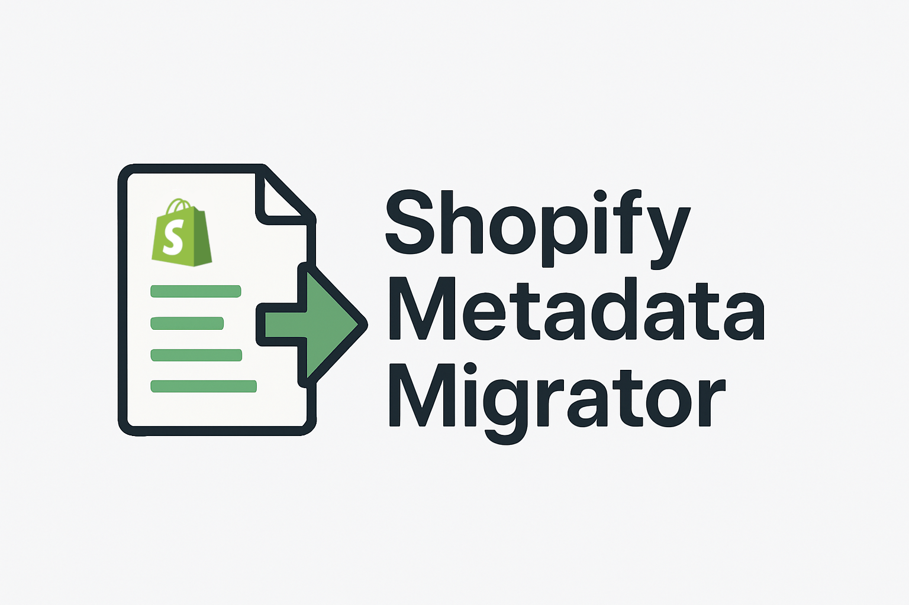

# Shopify Metadata Migrator

A Node.js script for copying Shopify Metafield and Metaobject definitions from one Shopify store to another. This tool is primarily designed for transferring configurations from development stores to production stores.

## Overview

This tool allows you to copy:
- **Metafield Definitions**: Custom field definitions for various Shopify objects (products, variants, collections, etc.)
- **Metaobject Definitions**: Custom object type definitions with their field structures

## Prerequisites

- **Node.js 18+** (required for native fetch support)
- Access to both source and target Shopify stores
- Admin API access tokens for both stores

## Installation

### Option 1: Install globally (recommended)
```bash
npm install -g shopify-metadata-migrator
```

### Option 2: Install locally
```bash
npm install shopify-metadata-migrator
npx shopify-metadata-migrator --help
```

### Option 3: Run directly (development)
```bash
# Clone or download this repository
git clone https://github.com/warriorachilles/shopify-metadata-migrator.git
cd shopify-metadata-migrator
# Ensure you have Node.js 18+ installed
# No additional dependencies required (uses native Node.js fetch)
node migrateShopifyMetafields.js --help
```

## Usage

### Basic Command Structure

```bash
shopify-metadata-migrator --sourceStore <source-store> --sourceToken <source-token> --targetStore <target-store> --targetToken <target-token> --metafields --metaobjects --shopifyObjectTypes <object-types>
```

### Parameters

| Parameter | Required | Description |
|-----------|----------|-------------|
| `--sourceStore` | Yes | Source Shopify store domain (e.g., `my-dev-store`) |
| `--sourceToken` | Yes | Source Shopify admin API access token |
| `--targetStore` | Yes | Target Shopify store domain (e.g., `my-prod-store`) |
| `--targetToken` | Yes | Target Shopify admin API access token |
| `--metafields` | No | Flag to copy metafield definitions |
| `--metaobjects` | No | Flag to copy metaobject definitions |
| `--shopifyObjectTypes` | Yes | Comma-separated list of Shopify object types for metafields |
| `--apiVersion` | No | Shopify API version to use (default: 2025-07) |

### Examples

#### Copy both metafields and metaobjects
```bash
shopify-metadata-migrator \
  --sourceStore my-dev-store \
  --sourceToken shpat_xxxxxxxxxxxxxxxxxxxx \
  --targetStore my-prod-store \
  --targetToken shpat_yyyyyyyyyyyyyyyyyyyy \
  --metafields \
  --metaobjects \
  --shopifyObjectTypes PRODUCT,PRODUCTVARIANT,COLLECTION
```

#### Copy only metafields
```bash
shopify-metadata-migrator \
  --sourceStore my-dev-store \
  --sourceToken shpat_xxxxxxxxxxxxxxxxxxxx \
  --targetStore my-prod-store \
  --targetToken shpat_yyyyyyyyyyyyyyyyyyyy \
  --metafields \
  --shopifyObjectTypes PRODUCT,COLLECTION
```

#### Copy only metaobjects
```bash
shopify-metadata-migrator \
  --sourceStore my-dev-store \
  --sourceToken shpat_xxxxxxxxxxxxxxxxxxxx \
  --targetStore my-prod-store \
  --targetToken shpat_yyyyyyyyyyyyyyyyyyyy \
  --metaobjects \
  --shopifyObjectTypes PRODUCT
```

#### Using default API version (2025-07)
```bash
shopify-metadata-migrator \
  --sourceStore my-dev-store \
  --sourceToken shpat_xxxxxxxxxxxxxxxxxxxx \
  --targetStore my-prod-store \
  --targetToken shpat_yyyyyyyyyyyyyyyyyyyy \
  --metafields \
  --metaobjects \
  --shopifyObjectTypes PRODUCT,COLLECTION
```

#### Using a specific API version
```bash
shopify-metadata-migrator \
  --sourceStore my-dev-store \
  --sourceToken shpat_xxxxxxxxxxxxxxxxxxxx \
  --targetStore my-prod-store \
  --targetToken shpat_yyyyyyyyyyyyyyyyyyyy \
  --metafields \
  --metaobjects \
  --shopifyObjectTypes PRODUCT,COLLECTION \
  --apiVersion 2025-01
```

### Supported Shopify Object Types

The `--shopifyObjectTypes` parameter accepts comma-separated values. Common types include:

- `PRODUCT`
- `PRODUCTVARIANT`
- `COLLECTION`
- `CUSTOMER`
- `ORDER`
- `PAGE`
- `BLOG`
- `ARTICLE`

For a complete list of supported types, see the [Shopify Admin API documentation](https://shopify.dev/docs/api/admin-graphql/2024-04/enums/MetafieldOwnerType).

## Limitations

⚠️ **Important Limitations to Be Aware Of:**

1. **Metaobject References**: The tool cannot copy metaobject definitions that contain fields with metaobject references (`metaobject_reference` type)
2. **Metafield Metaobject References**: The tool cannot copy metafields that are references to metaobjects
3. **API Complexity**: Creating these reference types programmatically requires specific metaobject IDs, which makes automated copying challenging

### What Gets Skipped

- Metaobject definitions with fields that reference other metaobjects
- Metafield definitions that reference metaobjects
- Any definitions that would cause API errors during creation

## API Version Management

The tool uses Shopify's Admin GraphQL API and supports version management:

- **Default Version**: Uses `2025-07` by default
- **Manual Override**: Use `--apiVersion` parameter to specify a different version
- **Version Compatibility**: Ensure both source and target stores support the specified API version
- **Future-Proofing**: When Shopify deprecates older API versions, you can easily switch to newer versions

### API Version Best Practices

1. **Use Default**: The tool uses 2025-07 by default, which is a stable and recent version
2. **Manual Override**: Use `--apiVersion` when you need a specific version
3. **Test First**: Test with a development store before using in production
4. **Monitor Deprecation**: Follow Shopify's API deprecation schedule

## How It Works

1. **Source Data Retrieval**: Fetches metafield and metaobject definitions from the source store using Shopify's Admin GraphQL API
2. **Data Transformation**: Processes the definitions to remove internal IDs and flatten nested structures
3. **Validation**: Checks for unsupported reference types and skips problematic definitions
4. **Target Creation**: Creates the definitions in the target store using the Admin GraphQL API
5. **Error Handling**: Reports any creation failures with detailed error messages

## Error Handling

The tool provides detailed error reporting:
- GraphQL errors are logged with full details
- Failed definition creations show specific user errors
- Original variables are logged for debugging purposes

## Security Considerations

- Store your access tokens securely
- Use environment variables for tokens in production environments
- Ensure tokens have appropriate permissions (read access to source, write access to target)
- Consider using private apps with limited scopes

## Troubleshooting

### Common Issues

1. **"GraphQL query failed"**: Check your access tokens and store domains
2. **"User Errors"**: Review the specific error messages for validation issues
3. **Missing definitions**: Some definitions may be skipped due to reference limitations

### Debug Mode

The tool provides verbose logging by default. Look for:
- `************ CREATING METAOBJECT DEFINITION FOR [name] *************************`
- `************ CREATING METAFIELD DEFINITION FOR [name] *************************`
- Success/failure messages for each definition

## Contributing

This tool was created by Zion Emond. Feel free to submit issues or improvements.

## License

This project is provided as-is for internal use. Please ensure compliance with Shopify's API terms of service when using this tool.

## Support

For issues related to:
- **Shopify API**: Refer to [Shopify's API documentation](https://shopify.dev/docs/api)
- **Tool functionality**: Check the error messages and ensure you're using Node.js 18+
- **Access tokens**: Verify permissions in your Shopify admin panel
